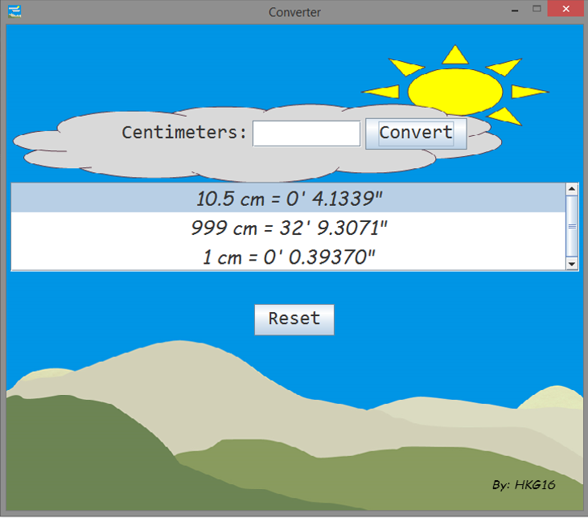

# Simple Measurement Converter Written in Java

A complete converter program with Java 
executable version (jar) for distribution. In the source code,
I demonstrated everything, even the unit tests.

For the unit tests, mostly, I just tested for the successful creation
of these objects so that we are sure of their existence.
It's up to you when you want to test
every method in the source code, or even every statement.
This is just the starting point.

The good thing about the background of the main frame, I did not get it
directly from an image file, but rather from the 
converted base64 encoding scheme,
just to show that everything that can be expressed in
bytes can also be easily managed and manipulated in computer programming.

The package is `xdvrx1ProjectSwing`. For the others who still don't know
the importance of a package in Java, this is used to manage the namespace
of your project. Imagine if there is no package, developers would end
up arguing, say, who should get `MyClass` class. Naming methods would
be so hard also because every name should be unique. 
 
For the GUI, I used Swing components. Swing is a lightweight version of AWT
and has been used for several years in GUI development. The most recent JavaFX
is another interesting GUI framework, but is not covered here.

The `MainMethodClass` contains the main method, where objects
are created. Those instances of JPanel and JFrame,
for example, can still be separated
in other classes to be more organized, but I decided not to. But there
are already classes separate from the main method like `JTextFieldLimit`
class.

Remember, in OOP there are three main concepts: 
`Encapsulation`, `Inheritance` and `Polymorphism`.

Encapsulation will enable a programmer to create modules, the internal
process is hidden and there is just the limited access to properties and
methods the programmer may see fit.

Inheritance will enable a programmer to re-use the existing codes and modify
just the parts as per requirement. Just like in Java, every object came from
`java.lang.Object`, so every instance manifests the basic behaviors defined in 
`java.lang.Object`. Yet, when a programmer creates another class with unique
behaviors, he/she can simply extend an existing class and just add or modify
some parts of it. That's the power of inheritance. You don't always start 
from scratch.

Polymorphism will enable a programmer to define an interface
and use that in many situations. For example, in real life, the dog's
sense of smell manifests polymorphism. It will trigger different behaviors
that depends on the input, whether the dog senses
food (salivate) or the presence of a stranger (bark). But there is
only one medium to accept the input, that is the dog's sense of smell.
If we represent that in programming, that is the interface. 
And this can be used for different situations.
That is *one interface for several methods*.

Combining these three main concepts of OOP, it can solve complex problems
in software development. 

## Q&A

If you have questions, please feel free to ask me. 

<mongAlvarez@gmail.com>
   
You can also create a pull request to start the discussion or queries.

## Compiling

To compile/run, for the complete detail, please refer to my documentation:
[MANUAL](https://gist.github.com/mongAlvarez/c6e1b7bc41a52f2eb90358a4e6f8589b#file-gist_001-md)

## Contributing

1. Fork it!
2. Then, made changes, and create a pull request. 
I'm much willing to collaborate with you!

## License

MIT- The permissive license
